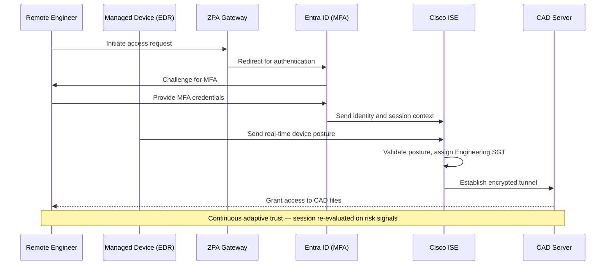

# Zero Trust Architecture Design — GaruDyne Aeronautics

Graduate coursework project (ITMS 475/575 — Zero Trust Architecture: Design & Implementation, Illinois Institute of Technology, Fall 2025) developing a full Zero Trust Architecture for a simulated 60,000-employee aerospace and defense manufacturer.

Co-authored with Mahesh Nutheti. Presented to a panel of industry practitioners (CISO, Security Architect, Network Engineer, IT Director roles) at the Cisco Chicago office.

## Overview

GaruDyne Aeronautics is a global aerospace and defense manufacturer with 60,000+ employees and 10,000+ contractors operating a hybrid IT/OT environment — on-prem CAD and manufacturing systems, cloud SaaS and HR platforms, and a global supplier network. Facing nation-state threats and strict regulatory obligations (ITAR, CMMC, GDPR, FAA Production Certificate requirements), GaruDyne needed to move from a traditional perimeter-based security model to a Zero Trust architecture.

This project was completed in two phases:

1. **[Requirements & Risk Analysis](./01-case-study-requirements.pdf)** — stakeholder access requests, compliance drivers, current-state pain points, and adversarial threat context across five business scenarios
2. **[Solution Design](./02-solution-design-document.pdf)** — a full Zero Trust architecture (NIST SP 800-207, NIST SP 1800-35, CISA Zero Trust Maturity Model v2.0) translating those requirements into policy, technology, and a phased implementation roadmap

## The Five Business Scenarios

| Scenario | Privilege Level | Key Pain Point (Before) | Policy Type (After) |
|---|---|---|---|
| Remote engineer accessing CAD files | Confidential | Broad VPN access, no continuous verification, geolocation not considered | ABAC |
| Supplier uploading specifications | Regulated | Password-only auth, no visibility into supplier identity | Contextual (Okta + CASB) |
| IoT sensors on factory floor | Internal Use | Unencrypted, unsegmented, difficult to patch | Risk-based policy |
| HR employee accessing personnel data | Confidential | MFA not globally enforced, unmanaged devices | RBAC + ABAC |
| R&D team uploading models | Confidential | Inconsistent data classification, sporadic encryption | ABAC + risk-adaptive |

## Architecture

The design maps each of the five NIST/CISA Zero Trust pillars (Identity, Device, Network, Application, Data) to a Policy Decision Framework (Policy Engine / Policy Administrator / Policy Enforcement Points / Policy Information Points):

| Component | Technology | Role |
|---|---|---|
| Policy Engine | Microsoft Entra ID Conditional Access + Okta Identity Governance | Evaluates identity, device posture, geolocation, risk score |
| Policy Administrator | Cisco ISE + Azure Conditional Access | Translates PE decisions into VLAN/SGT assignments |
| Policy Enforcement Points | Zscaler ZPA + Palo Alto firewalls + Aruba ACLs | Enforces micro-segmentation and session policy |
| Policy Information Points | Microsoft Intune, CrowdStrike Fusion, Splunk SIEM/UEBA | Supplies real-time telemetry to the PE |
| Data Protection / CASB | Microsoft Purview | Classification, encryption, DLP, CASB inspection of supplier uploads |
| Visibility & Analytics | Splunk SIEM + UEBA + Azure Sentinel | Cross-environment log correlation, automated playbooks |

### Example Trust Flow — Remote Engineer Accessing CAD Files

If risk increases mid-session (unusual location, posture drift), the Policy Engine can force step-up MFA, downgrade to read-only, or terminate the session.

## Implementation Roadmap

| Phase | Timeline | Focus |
|---|---|---|
| 1 — Foundational | 0–12 months | MFA/SSO baseline (Entra ID, Okta), endpoint registration (Intune, CrowdStrike), SIEM logging |
| 2 — Integrated | 12–30 months | Cisco ISE NAC rollout, Zscaler ZPA (VPN-less access), Purview data classification |
| 3 — Optimized | 30–48 months | Automated risk-based access playbooks, Sentinel integration, executive Zero Trust dashboard |

Target outcomes: 80–90% reduction in credential-based attack surface, elimination of broad VPN exposure, ≥95% policy compliance rate, 100% MFA enrollment.

## Frameworks & Compliance

- **NIST SP 800-207** — Zero Trust Architecture
- **NIST SP 1800-35** — Implementing a Zero Trust Architecture
- **CISA Zero Trust Maturity Model v2.0**
- Regulatory drivers: **ITAR**, **CMMC**, **GDPR**, **FAA Production Certificate**

## Documents

- [`01-case-study-requirements.pdf`](./01-case-study-requirements.pdf) — Full requirements and risk analysis
- [`02-solution-design-document.pdf`](./02-solution-design-document.pdf) — Full 23-page Zero Trust Solution Design Document
